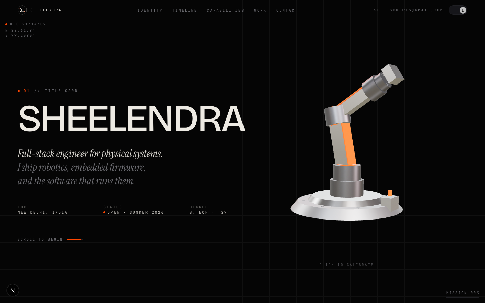
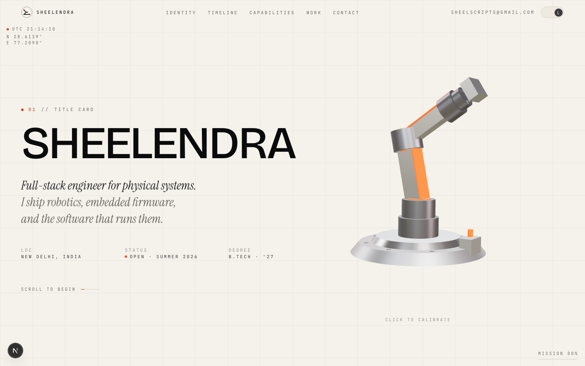
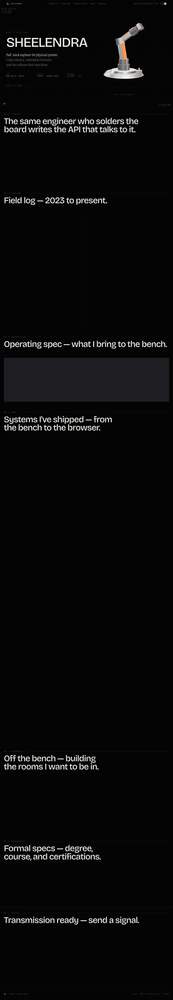
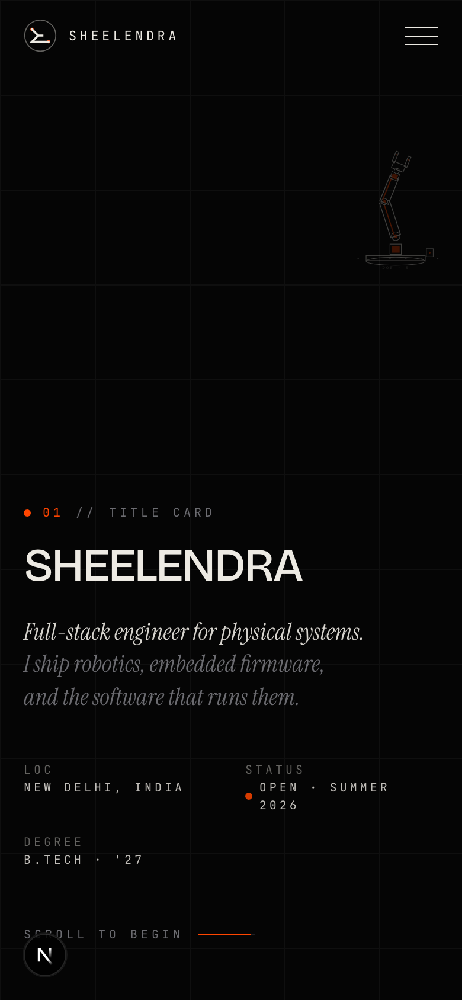
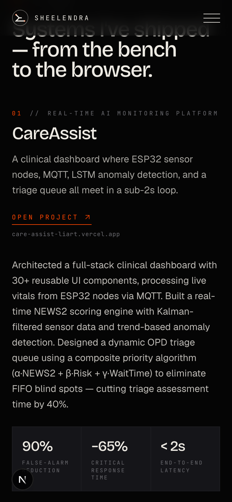
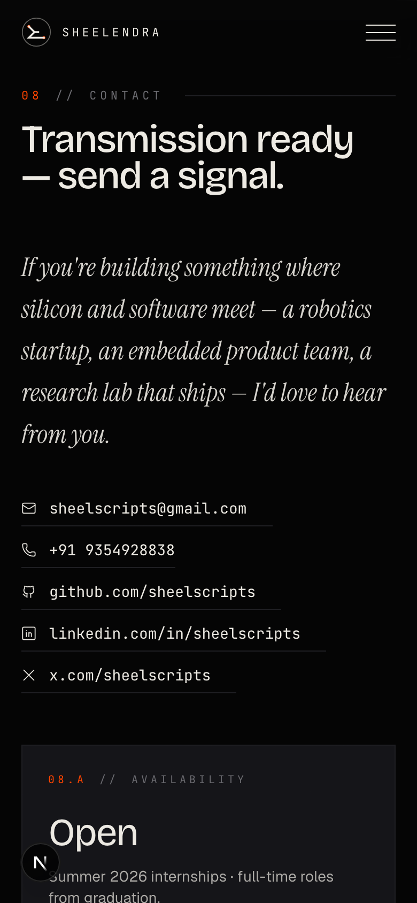

# Sheelendra — Portfolio

A single-page, scroll-driven portfolio for **Sheelendra** — full-stack engineer for physical systems, B.Tech Automation & Robotics at GGSIPU-USAR.

Built in the **Industrial Cinema** aesthetic: pitch-black background, brushed-steel surfaces, oversized cinematic typography, and a signature 3D robotic arm. Every section is numbered like a CAD drawing, every line of copy is a single source of truth, and the whole experience respects `prefers-reduced-motion` end-to-end.

---

## Preview

### Desktop — dark mode (default)



### Desktop — light mode



### Full page (1440px · dark)



### Mobile (390px · dark)

| Hero | Work | Contact |
| --- | --- | --- |
|  |  |  |

---

## Stack

- **Next.js 16.2.9** (App Router, Turbopack) — see `CLAUDE.md` for current-API notes
- **React 19.2.4** + **TypeScript 5**
- **Tailwind CSS v4** via `@tailwindcss/postcss` — tokens live in `app/globals.css`
- **`motion` 12** (`motion/react`) — scroll-triggered reveals
- **Lenis** — smooth scroll (auto-disabled under reduced-motion)
- **Three.js** + **`@react-three/fiber`** + **`@react-three/drei`** — the hero 3D robotic arm (lazy-loaded, falls back to a hand-authored SVG for SSR / reduced-motion)
- **lucide-react** + custom inline brand icons in `components/ui/BrandIcons.tsx`

## Quick start

```bash
npm install
npm run dev          # localhost:3000
```

```bash
npm run build        # production build
npm run start        # serve production
npm run lint         # eslint
```

## Project structure

```
app/                 ← App Router entrypoint
  layout.tsx              fonts, metadata, no-FOUC theme script
  page.tsx                composes all scenes inside <ThemeProvider>
  globals.css             @import "tailwindcss" + @theme tokens + .scene utility

lib/                 ← single source of truth for content
  data.ts                 ALL resume-derived copy (timeline, projects, skills, contact)
  theme.ts                inline no-FOUC theme bootstrap

components/
  brand/Monogram.tsx              inline SVG "S" mark
  providers/                       ThemeProvider, SmoothScroll (Lenis)
  scene/                          8 numbered scenes (Boot → Hero → … → Contact)
  three/                          RoboticArm.tsx + RoboticArmFallback.tsx
  ui/                             Nav, ThemeToggle, CornerReadout, SceneHeader, Reveal, BrandIcons

public/              ← static assets, screenshots used in this README
```

## Story arc (8 scenes)

```
00 · BOOT          first-visit overlay (sessionStorage-gated, reduced-motion aware)
01 · TITLE CARD    hero — massive lockup + 3D robotic arm
02 · IDENTITY      editorial pull-quote + bio
03 · TIMELINE      career chronology
04 · CAPABILITIES  4-column spec sheet (Robotics / Embedded / AI / Web)
05 · WORK          inline project showcases, alternating left/right
06 · LEADERSHIP    role cards
07 · CREDENTIALS   education + coursework + certs
08 · CONTACT       transmission panel + 4 socials + availability card
```

## Interactivity

- **3D robotic arm** — click anywhere on the arm to run a 6.5s calibration sweep (shoulder → elbow → wrist roll → wrist pitch → gripper → return to rest). Every click restarts the sequence from frame zero. `prefers-reduced-motion: reduce` users get the static SVG fallback instead.
- **Lenis smooth scroll** — disabled when `prefers-reduced-motion: reduce` matches.
- **Theme toggle** — light + dark, persisted to `localStorage`, defaults to system preference. No flash on first paint (inline script in `<head>`).
- **Live telemetry** — fixed corner readouts (live UTC + Delhi coordinates, page progress as `MISSION %`).

## Conventions

- All copy lives in `lib/data.ts` — never hardcode resume-derived text in components.
- Single source of color truth — every color is a `--color-*` CSS variable exposed via Tailwind v4's `@theme inline`. Never inline hex values.
- Server components by default; only add `"use client"` when the component needs state, effects, or event handlers.
- Reuse `<Reveal>` for scroll-triggered entrances. It already short-circuits under reduced-motion.

## License

Personal portfolio. All rights reserved by the author.
